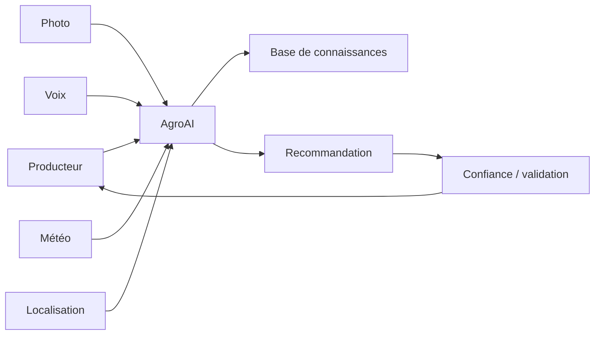

# HashCode AgroAI

> Copilote agricole multimodal pour aider les producteurs à accéder à des informations contextualisées et compréhensibles.

**Domaine:** Applied AI · **Programme:** HashCode Global Impact · **Statut:** Research / MVP discovery

## Problème
Les petits producteurs peuvent manquer d'accès rapide à des informations fiables sur maladies, météo, pratiques culturales, marchés et risques climatiques.

## Vision
Combiner image, voix, météo, localisation et connaissances agricoles dans un assistant avec niveau de confiance et validation humaine lorsque nécessaire.

## Cartographie

## MVP
Diagnostic visuel expérimental, assistant vocal, météo contextualisée, fiches culturales et journal des recommandations.

## Garde-fous
Les sorties sont des recommandations et non des certitudes. Tester localement, afficher l'incertitude et prévoir validation par des experts agricoles pour les cas sensibles.

## Impact
Exploitations accompagnées, précision validée sur le terrain, pertes évitées, adoption et évolution des rendements lorsque mesurable.

## Contribuer
Voir : https://github.com/HashCode-Reboot/hashcode-contributors

**Doctrine HashCode:** *Build for Africa. Scale for Humanity.*