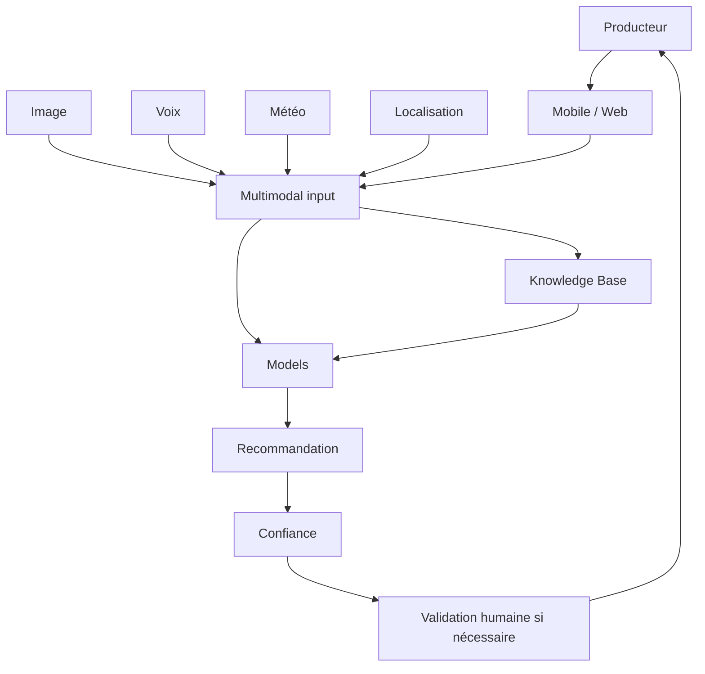

# Architecture — AgroAI

## Principes

Séparer observations, prédictions et recommandations. Afficher l'incertitude. Tester les modèles sur les cultures, langues et conditions locales avant utilisation réelle.